<!-- ========================================================= -->
<!-- HERO -->
<!-- ========================================================= -->

  

  

  
  

  
  
  
  

---

## About

**AI engineer** building agents that make decisions: task orchestration, voice calling, browser automation, and safety review, shipped as full-stack products.

<table align="center" width="100%">
<tr>
<td width="50%" align="center"><b>Agentic AI</b> multi-agent, tool use, guardrails</td>
<td width="50%" align="center"><b>Voice AI</b> real-time calls, regional languages</td>
</tr>
<tr>
<td width="50%" align="center"><b>Web Agents</b> browser automation, queues</td>
<td width="50%" align="center"><b>Full Stack</b> Next.js, FastAPI, Postgres</td>
</tr>
</table>

---

## Tech Stack

  

  
  
  
  
  
  
  
  
  
  
  

---

## Selected Projects

<table width="100%">
<tr>
<td width="50%" valign="top">
<a href="https://github.com/fncreator22/browserpilot"><strong>BrowserPilot</strong></a> 
Autonomous browser agent for research and task execution. 
Gemini · Playwright · BullMQ · Prisma
</td>
<td width="50%" valign="top">
<a href="https://github.com/fncreator22/campaigncraft-ai-platform"><strong>CampaignCraft AI</strong></a> 
Multimodal studio that turns campaign briefs into advertising creative. 
AI creative · campaign production
</td>
</tr>
<tr>
<td width="50%" valign="top">
<a href="https://github.com/fncreator22/Daybook-app"><strong>Daybook</strong></a> 
Agenda, tasks, meeting notes, and reflections in one workspace. 
Planning · productivity
</td>
<td width="50%" valign="top">
<a href="https://github.com/fncreator22/agentic-datingp-site"><strong>Agentic Dating Site</strong></a> 
Dating platform built around agentic AI. 
Agents · full stack
</td>
</tr>
<tr>
<td width="50%" valign="top">
<a href="https://github.com/fncreator22/sentinel-mcp"><strong>Sentinel MCP</strong></a> 
Three-stage safety guardrail for LLM coding assistants. 
MCP · policy checks · audit trail
</td>
<td width="50%" valign="top">
<a href="https://github.com/fncreator22/NexWare-ERP"><strong>NexWare ERP</strong></a> 
Business platform for people, products, processes, and performance. 
ERP · operations
</td>
</tr>
</table>

<strong>Additional projects</strong>

 
<table width="100%">
<tr>
<td width="50%" valign="top"><a href="https://github.com/fncreator22/voice-notes-ai"><strong>Voice Notes AI</strong></a> Whisper-powered speech-to-text application.</td>
<td width="50%" valign="top"><a href="https://github.com/fncreator22/Development-of-a-Multi-Turn-Conversational-AI-Bot"><strong>Conversational AI Bot</strong></a> GPT-4 customer-support bot with multi-turn conversations.</td>
</tr>
<tr>
<td width="50%" valign="top"><a href="https://github.com/fncreator22/study-swift"><strong>Study Swift</strong></a> Learning management and assessment platform.</td>
<td width="50%" valign="top"><a href="https://github.com/fncreator22/ECG-feature-extraction"><strong>ECG Feature Extraction</strong></a> ECG signal feature extraction project.</td>
</tr>
</table>

Also building voice AI agents for Indian regional languages and synthetic QA for voice agents.

---

## GitHub Analytics

All-time activity, automatically refreshed every two hours.

---

  

